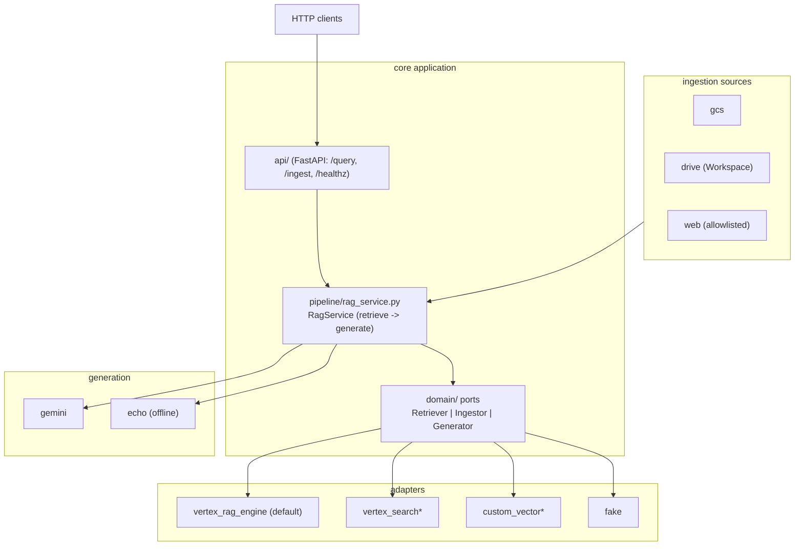

# RAGonGCP — Architecture

RAGonGCP is a **ports-and-adapters** RAG accelerator for Google Cloud. The
application core (config, domain models, pipeline) is backend-agnostic; concrete
GCP services live behind adapters selected by config. You reuse it on a new
engagement by adding a profile + ingestion sources, not by editing core code.

## Layers

\* `vertex_search` and `custom_vector` are stubs in this POC.

## Key flows

**Query:** `POST /query` → `RagService.query` → `Retriever.retrieve` (top-k
chunks) → `Generator.generate` (Gemini, grounded) → `Answer` with inline `[n]`
citations mapped back to source chunks (`generation/prompt.py`).

**Ingest:** `ingestion/run.py` builds `Source`s from the profile, each
`collect()`s `Document`s (GCS objects, Drive files, or web pages staged to GCS),
then `Ingestor.upsert` imports them into the corpus.

## Configuration

`config/default.yaml` holds base defaults; `config/<profile>.yaml` overlays
per-use-case values (deep-merged in `config.py`). Environment settings
(`RAGONGCP_*`) carry project/location/secrets. `RAGONGCP_PROFILE` switches the
whole use case; `RAGONGCP_BACKEND` can override the retrieval backend (e.g.
`fake` for offline dev).

## Adding a new backend

1. Create `adapters/<name>/client.py` with a class implementing `ensure_corpus`,
   `upsert`, and `retrieve` (see `domain/*.py`).
2. Add a branch in `adapters/factory.py`.
3. Set `backend: <name>` in a profile.

The `vertex_search` and `custom_vector` adapters are scaffolded stubs showing
exactly where each method goes.

## Adding a new use case

1. Add `config/<use_case>.yaml` (corpus name, system prompt, ingestion sources,
   web allowlist).
2. Point ingestion sources at the client's Drive folder / governance URLs.
3. Set `RAGONGCP_PROFILE=<use_case>` and ingest.
