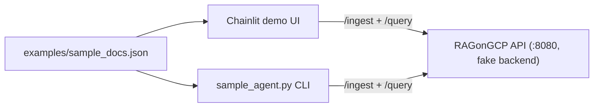
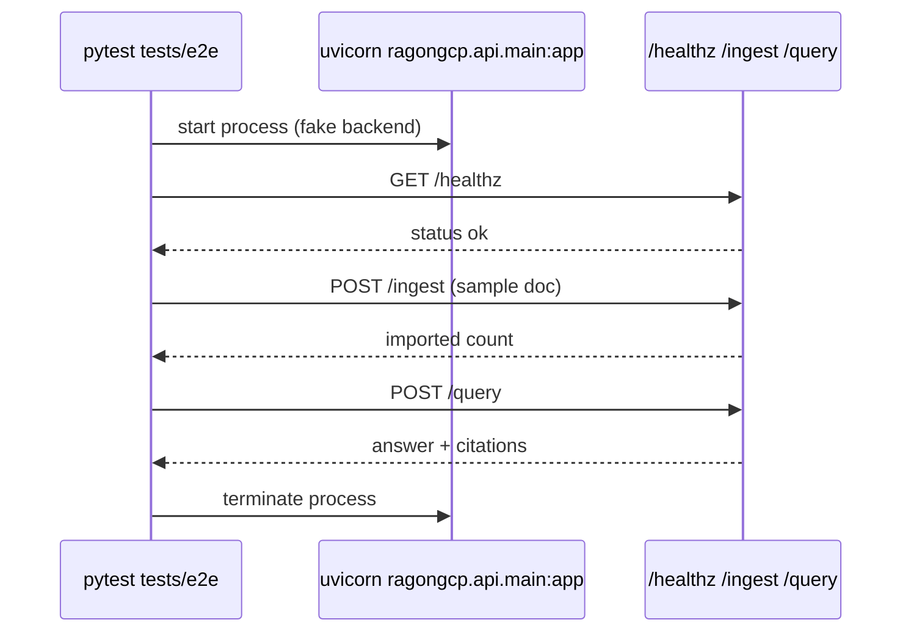

# Demo and Testing Guide

This guide explains how to run stakeholder demos and validate end-to-end behavior
with the same API contract.

## Local demo flow



### 1) Start API

```bash
make run
```

### 2) Start Chainlit demo UI

```bash
make demo-chainlit
```

Use `/help` and `/ingest` in the Chainlit chat.

### 3) Alternative: CLI demo

```bash
uv run python scripts/sample_agent.py
```

## End-to-end test flow



Run:

```bash
make test-e2e
```

## Useful environment variables

- `RAG_API_URL` — API base URL for Chainlit (`http://localhost:8080` by default)
- `RAG_DEMO_DOCS` — sample docs path
- `RAG_DEMO_AUTO_INGEST` — auto-ingest on chat start (`true` by default)
- `RAG_DEMO_TOP_K` — optional retrieval override for demo queries
